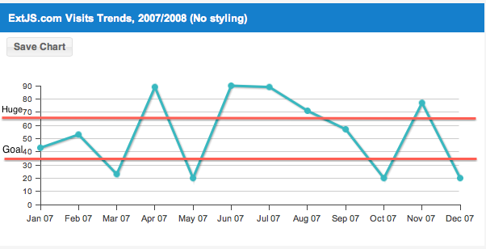

+++
date = "2013-09-07T17:50:16+03:00"
title = "How to add custom sprites in ExtJS charts"
description = ""
tags = [
    "javascript",
    "charts",
    "extjs4",
    "plugin",
    "sprite"
]
categories = [
    "Charts",
    "Javascript",
    "ExtJS 4"
]
+++

Though ExtJS charts are very rich in features sometimes our clients want more. Very often they want some specific features which in the end leads to adding new custom sprites to the charts. And ExtJS is ready to help us with the needed tools to accomplish those features and make the client happy.

In this post I&#8217;m going to add some light on how to add custom sprites in ExtJS charts based on a real world example. Let&#8217;s say that the client would need sort of threshold line which would outline a few areas on the chart.



First thought which comes is how this feature would be integrated in our chart component, in a easy way that is usual for ExtJS and its users. Right, first we would need some chart configs, something like these ones below, or even could be an array of them:

<!-- more -->
``` javascript
{
    threshold: 36,
    title: 'Goal'
 }
```

Luckily we can benefit of ExtJS&#8217;s tools like plugins, mixins, extensions and drawing classes. Assuming that you know already the difference between a mixin and a plugin, I&#8217;ll answer to the question which we brought earlier that for integration we would need a plugin.

Now we can wrap those configs in a plugin config, in a chart component:
``` javascript
Ext.create('Ext.chart.Chart', {
        plugins: [{
            ptype: 'chartthresholds',
            items: [{
                  threshold: 36,
                  title: 'Goal'
            },{
                threshold: 66,
                title: 'Huge'
            }]
        }]
    });
```

Having already the definition of the task, now we can define our plugin:

``` javascript
Ext.define('Ux.chart.Thresholds', {
    extend: 'Ext.AbstractPlugin',
    alias: "plugin.chartthresholds",
    constructor: function(config) {
      var me = this;

      // The collections of threshold items
      me.items = [];

      if (config) {
          Ext.apply(me, config);
      }
    },
     /**
     * The plugin initialization method which the owning Component calls at Component initialization time.
     */
    init : function(chart){}

    /**
     * The plugin cleanup method which the owning Component calls at Component destruction time.
     */
    destroy : function() {}
```

As you see from task definition we can have more threshold items, so our plugin will have a second purpose, which is, to act as a collection of threshold items.

Now as we have the collection class prototyped we need the item, a ExtJS tool to use for to display on the chart a line and a text. Always look the answer in ExtJS source code in the respective classes. Since we are working with charts and drawing we can get the answer in a snap by looking for example how Legend is created, that we need to use Sprites to draw both the line and the text and a CompositeSprite to wrap them. 

But why would we need a CompositeSprite ? as the docs say a composite Sprite handles a group of sprites with common methods to a sprite such as hide, show, setAttributes. These methods are applied to the set of sprites added to the group. I would add also to importance the destroy method.

Our threshold item gets the following definition:

``` javascript
Ext.define('Ux.chart.ThresholdItem', {
        extend: 'Ext.draw.CompositeSprite',

        visible: false,

        constructor: function(config) {
            var me = this;

            if (config) {
                Ext.apply(me, config);
            }

            me.callParent();

            me.on('mousedown', me.onMouseDown, me);
        },

        /**
         * @private Handler for threshold selecting/deselecting
         */
        onMouseDown: function() {
        }
    });
```

Next will finish our prototyping with adding methods definitions to the plugin for both sprites, the line and text:

``` javascript
Ext.define('Ux.chart.Thresholds', {
    extend: 'Ext.AbstractPlugin',

    .....................

   /**
    * @private Redraws all items, called after each chart redraw
    */
    redraw: function(){},

    /**
     * @private Draws threshold items
     */
     drawItems: function(){},

    /**
     * @private Creates label sprite and/or redraws it to the given position
     */
    drawLabel: function(item,x,y,z) {},

    /**
     * @private Creates line sprite and/or redraws it to the given position
     */
    drawLine: function(item,fromX, fromY, toX, toY, z) {
```

Once we are done with prototyping we can proceed to sprites drawing.

``` javascript
drawLine: function(item,fromX, fromY, toX, toY, z) {
            var line = item.get('line'),
                path = 'M' + fromX + ',' + fromY + 'L' + toX + ',' + toY;

            if(line){
                line.setAttributes({ path : path},true);
            }else{
                line = item.add('line', item.surface.add({
                    type: 'path',
                    path: path,
                    zIndex: z,
                    "stroke-width": this.lineWidth,
                    opacity: 0,
                    fill: '#a0142c',
                    stroke: this.lineStroke,
                    style: {
                        cursor: 'pointer'
                    }
                }));
            }

            return line;
        },
        drawLabel: function(item,x,y,z) {
            var label = item.get('label');

            if(label){
                label.setAttributes({ x:x, y:y },true);
            }else{
                label = item.add('label', item.surface.add({
                    type: 'text',
                    x: x,
                    y: y,
                    zIndex: z,
                    fill: this.labelColor,
                    font: this.labelFont,
                    text: item.title,
                    style: {
                        cursor: 'pointer'
                    }
                }));
            }
            return label;
        }
```

Drawing methods are ready, it&#8217;s time to get their coordinates. The coordinates are relative to design specifications, what&#8217;s important is to get the idea on how to get them and how to use. Once you understand this you can play with positioning according to your designs. Below method it&#8217;s what you would need to get started with the game.

``` javascript
drawItems: function(){
            var me = this,
                chart = me.cmp,
                axes = chart.axes,
                leftAxis = axes.get('left'),
                stepHeight = leftAxis.length / (leftAxis.to - leftAxis.from),
                x2 = leftAxis.width + leftAxis.x,
                zIndex = (this.zIndex || 0) + 2,
                items = me.items,
                li = items.length,
                i = 0,
                y1,item;

            for (; i &lt; li; i++) {
                item = items[i];

                y1 = leftAxis.y - stepHeight * item.threshold;

                me.drawLabel(item,5,y1, zIndex + 1);
                me.drawLine(item,5,y1-1,x2,y1-1,zIndex);

                if(!item.visible){
                    item.setAttributes({
                        hidden: false
                    }, true);

                    item.visible = true;
                }
            }
        }
```

It&#8217;s time to instantiate the items:

``` javascript
createItems: function() {
            var me = this,
                surface = me.cmp.surface,
                items = me.items,
                li = items.length,
                i = 0,
                item;

            for (; i &lt; li; i++) {
                item[i] = Ext.create('Ux.chart.ThresholdItem',Ext.apply({
                    thresholds: me,
                    surface: surface
                },items[i]));
            }
        }
```

Then finally redraw and init the plugin:

``` javascript
init: function (chart) {
            this.labelColor = chart.textColor;

            if(this.visible)
                Ext.Function.interceptAfter(chart,"redraw",this.redraw,this);
        },
        redraw: function() {
            var me = this;

            if (!me.created) {
                me.created = true;
                me.createItems();
            }

            if(me.visible)
                me.drawItems();
        }
```

Notice that the visible config, you could add a few lines of code to add some laziness and to make the threshold item visible later but not at first chart redraw.

And yes, we end with cleaning:

``` javascript
destroy: function(){
            var items = this.items,
                li = items.length,
                i = 0;
            
            for (; i &lt; li; i++) {
                items[i].destroy();
            }
        }
```

That&#8217;s it, have a enjoyable charts customizing process.